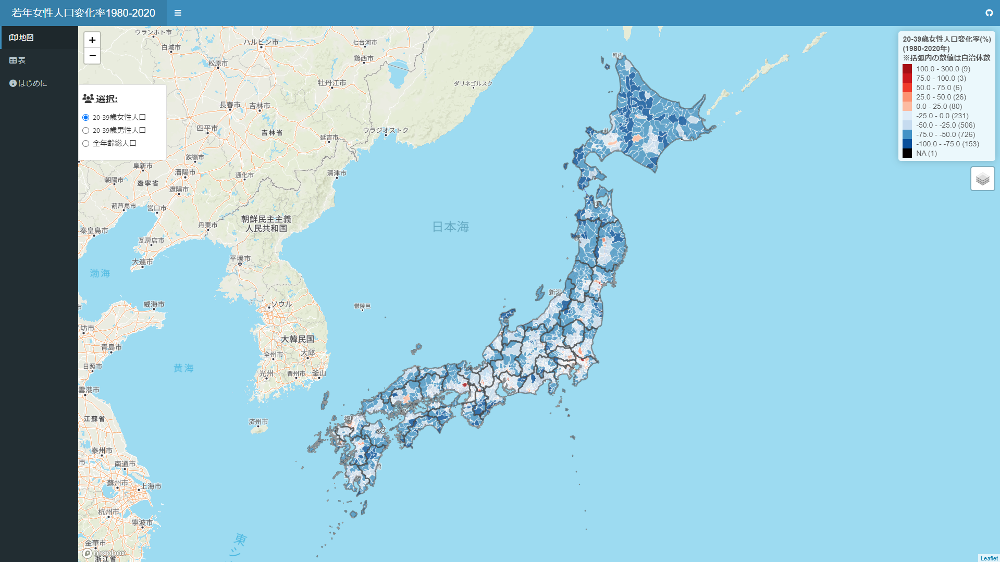

# 若年女性人口変化率1980-2020

昭和55年国勢調査と令和2年国勢調査を用いて、1980年から2020年の間の20歳から39歳までの女性人口の変化率を地図上で可視化しています。  
URL: https://keisuke-kondo.shinyapps.io/female-population-japan/

## 作成者

近藤恵介  
独立行政法人経済産業研究所・上席研究員  
神戸大学経済経営研究所・准教授  
URL: https://keisukekondokk.github.io/  

## 利用規約
当サイトで公開している情報（以下「コンテンツ」）は、どなたでも自由に利用できます。コンテンツ利用に当たっては、本利用規約に同意したものとみなします。本利用規約の内容は、必要に応じて事前の予告なしに変更されることがありますので、必ず最新の利用規約の内容をご確認ください。

### 著作権
本コンテンツの著作権は、近藤恵介に帰属します。

### 第三者の権利
本コンテンツは「政府統計の総合窓口（e-Stat）」([https://www.e-stat.go.jp/](https://www.e-stat.go.jp/))より、「昭和55年国勢調査」、「令和2年国勢調査」、「統計地理情報システム」のデータに基づいて作成しています。本コンテンツを利用する際は、第三者の権利を侵害しないようにしてください。

### 免責事項
<ul>
<li>作成にあたり細心の注意を払っていますが、本サイトの内容の完全性・正確性・有用性等についていかなる保証を行うものでありません。</li>
<li>本サイトを利用したことによるすべての障害・損害・不具合等、作成者および作成者の所属するいかなる団体・組織とも、一切の責任を負いません。</li>
<li>本サイトは、事前の予告なく変更、移転、削除等が行われることがあります。</li>
</ul>

### その他
本コンテンツに関する問い合わせについて、下記のEmailより近藤恵介宛までご連絡ください。

Email: kondo-keisuke@rieti.go.jp

## データ出所

### 令和2年国勢調査（e-Stat）：表番号2-7-1、男女，年齢（5歳階級），国籍総数か日本人別人口－全国，都道府県，市区町村（2000年（平成12年）市区町村含む）

URL: https://www.e-stat.go.jp/stat-search?page=1&toukei=00200521&bunya_l=02

### 昭和55年国勢調査（e-Stat）：表番号00101、男女の別（性別）（３），年齢５歳階級（２３），人口

URL: https://www.e-stat.go.jp/stat-search?page=1&toukei=00200521&bunya_l=02

### 統計地理情報システム（e-Stat）：都道府県・市区町村シェープファイル

URL: https://www.e-stat.go.jp/gis

## 更新履歴

2024年4月26日：ウェブ公開  
